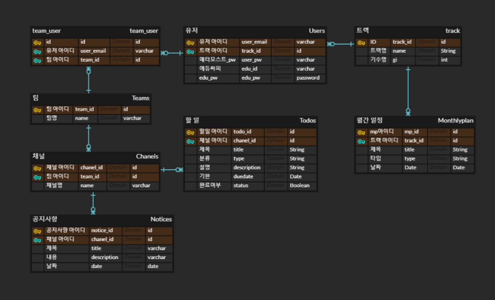
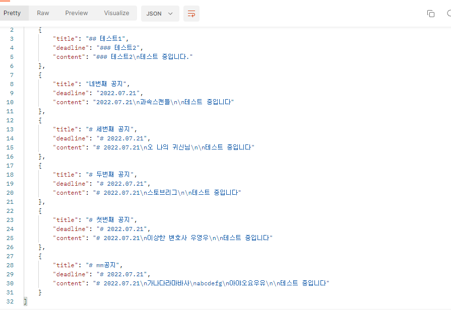
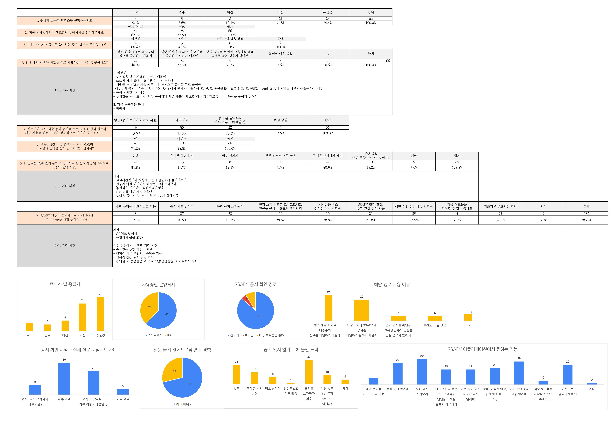

# README

> SSAFY 7기 부울경캠퍼스 공통2반 4팀

## 

## 목차

## 프로젝트 개요

1. 주제 및 기간

2. 기획의도 및 컨셉

3. Wireframe

4. DOM Tree

5. 개발 환경 및 사용 기술

6. ERD
   
   

​        링크 > https://www.erdcloud.com/d/LyNuWixQvXC7drnZA

7. 

8. 주제 :

기간 : 2022년 7월 5일 ~ 22년 8월 19일

#### 1. 주제 및 기간

- 주제 : 

- 기간 : 2022년 7월 5일 ~ 22년 8월 19일

#### 2. 기획의도 및 컨셉

- 기획 의도

- 컨셉

- 주요 기능

#### 3. Wireframe

#### 4. DOM Tree

#### 5. 개발 환경 및 사용 기술

- 개발 환경
  
  - Windows 10, 11
  
  - Mac

- 개발 도구
  
  - Visual Studio Code 1.69.2
  
  - Git 2.37

- 커뮤니케이션
  
  - Mattermost
  
  - Discord
  
  - Kakaotalk
  
  - Notion

- 디자인
  
  - Figma

- DB
  
  - Maria DB 10.8.3

- Server
  
  - AWS EC2
    
    - Ubuntu 18.04 LTS

- Front-End
  
  - JavaScript
  
  - HTML5, CSS3
  
  - Node.js 16.16.0
  
  - React Native 
    
    - expo 5.5.1
      
      - Redux
      
      - Navigation
  
  - Android Studio 2021.2.1 Patch 1
    
    - Android Vertual Device Emulator
      
      - Pixel 2 + API level 30(Android 11.0)

- Back-End
  
  - Java open-JDK zulu 8.62.0.19-CA-win64
    
    - SpringBoot 2.7.1
    - Gradle 7.4.1
    - Lombok
    - JPA, Security, Https, My-batis
      IDE :
    - Spring Tool Suite 4 4.15.1.1.RELEASE

- API
  
  - [Mattermost API](https://api.mattermost.com/)
  
  - Kakaotalk API

# 구현 기능 정리

날짜: 2022년 7월 19일 오후 4:30
참석자: 강현준(팀장), 김지현, 박지현, 이재준, 전현우, 조현빈

### 처음 시작 (mm 사용자 임을 증명 = 나는 싸피인이다)

- 이메일
- 비밀번호

### 메인 페이지

- to-do-list
  
  - 기본 모습(리스트 된)
    - 제목
    - 기한
    - 현재 상태
      - 완료
      - 진행 (blue)
      - 종료 (red)
  - 상세내용(요건 클릭하면 볼 수 있게)
    - 내용
    - 생성일자(굳이 필요할까라는 생각은 드는데 일단 넣어봄)
    - 출처
      - MM 링크 제공 여부?
      - 문자인지, mm인지, 에듀싸피인지
    - 공유하기
      - 카카오톡, 메일, 친구에게 보내기(같은 서비스 이용 중인 싸피교육생에게)
    - 중요도?(MM에서 긁어오는 것⇒ MM이니 중요도 최상, 자체 작성은 사용자가 넣기)
      - 마감 일시 기준으로 중요도 매기기?

- 주별 일정 정리
  
  - 해당 주차 일정 간략하게 작성 (월~금)
    - ex) 대면, 정기면담 신청, 7기 사연함
  
  

- 월간은 필요없나여 그럼 주간까지만?
  
  - ⇒ 프론트 맘대루~
  - 월간 데이터가 필요하면 그렇게 맞춰서 넘겨줄 순 있습니다.
  - 휴대폰 화면에 월간 다 넣으면 너무 빡빡해 보이지 않을까요? 저는 주단위로해서 밑으로 스크롤하면 한 주씩 더 생기는? 그런거 생각했는데
    - ⇒ 좋은듯
    - ⇒ 프론트 맘대루 2222
    - ⇒ 해당 주차만 메인 페이지 / 월은 따로 탭을 만들면 너무 불편할까요?
      - 나쁘지 않은듯 합니다.

### 개인페이지

- 기본 인적사항
  - 닉네임 or 이름
  - 기수
  - 트랙
  - 프로필 사진?
    - 프로필 사진은 mm에 설정된거 못긁어 오나요?(좋은 생각이네요)
    - 직접 해보라고요? 네 알겠습니다 ㄱㄷ ⇒ getMe에는 없음 ㄲㅂ
      - 저거 이미지 데이터가 DB에 없어서 힘들지 않을까요?
- 개인 설정
- 밑에껀 공지에 넣는게 맞을듯?
  - 트랙별 공지(MM내 본인 트랙 공지)
    - 트랙 Python , Java 등
    - 자기 반별 공지(Python 부울경 1반, Java 3반 등)
  - 소속팀(스터디 or 모임) 공지
    - 추후 생각해봐요
    - 넵
    - 이거 그냥 어차피 똑같아여 공지사항 긁어오는거랑

### 공지사항

- 공지사항 리스트
  - 제목
  - 날짜
  - 출처
  - 상세페이지
    - 제목
    - 날짜
    - 출처
    - 내용
    - 작성자?
      


### 페이지 구성 관련 의견 정리

- todolist 보여줄 때 마감기간으로 소팅해서 보여주기
  
  - 오늘마감이거나 하면 빨간색으로 표시 등

- 여러 기한을 한페이지에 다 보여주면 좋을것같아여
  
  - 하루 남은거 몇개 / 일주일 남은거 몇개

- to do list만 있되 맨위에 약간 기간 별로 몇개 나와있는지 보여주고 플러스버튼 둬서 본인이 추가할수있는정도만


- 그냥 리스트로 보여주는데 마감기한별로 소팅돼있는게 더 깔끔

- 위에 투두 넣고 아래 이렇게


- 메인에는 투두 들어가고 오른쪽 같은 느낌으로 다른 탭 작성


# 샘플 API

### MatterMost

- GET 본인 정보

- GET 포스트

- GET 채널

- GET ToDoList
  
  - ```java
    @GetMapping(value = "/createToDoList")
        public ResponseEntity<ArrayList<ToDo>> createToDoList() {
            MattermostClient client;
            client = MattermostClient.builder().url("https://meeting.ssafy.com").logLevel(Level.INFO)
                    .ignoreUnknownProperties().build();
            //client 로그인
            client.login(mmEmail, mmPassword);
    
            long since = System.currentTimeMillis() - 3600000;
            list = client.getPostsSince("qhmimsx573fnugb3yrjtkpokao", since);
            // postList 탐색하면서 todolist에 넣을 것만 뽑아내기
            ArrayList<ToDo> rst = service.createToDoList(list.readEntity());
            return new ResponseEntity<>(rst, HttpStatus.OK);
        }
    ```
  
  - 

- POST 공지
  
  - 어플에서 todolist에 넣을 공지 생성
  - ```java
    @PostMapping(value = "/createNotice")
        public ResponseEntity<String> createNotice(ToDo todo) {
            System.out.println(todo);
            login();
            String notice = service.createNotice(todo);
            System.out.println("notice : " + notice);
    // 테스트 채널 ID를 가지는 테스트 post 생성
            Post post = new Post("qhmimsx573fnugb3yrjtkpokao", notice);
    // 테스트 채널에 포스트 생성
            client.createPost(post);
            return new ResponseEntity<>("success", HttpStatus.OK);
        }
    ```
  - .png)

### Edu SSAFY 크롤링

- ```java
  // 월간 일정
  List<WebElement> list = driver.findElements(By.className("fc-content-skeleton"));
  ArrayList<ArrayList<Box>> boxes = new ArrayList<>();
  
  for (int i = 0; i < list.size(); i++) {
    WebElement table = list.get(i);
    boxes.add(new ArrayList<Box>());
  
    List<WebElement> theadTrTd = table.findElement(By.tagName("thead")).findElement(By.tagName("tr"))
        .findElements(By.tagName("td"));
  
    for (int j = 0; j < theadTrTd.size(); j++) {
      boxes.get(i).add(new Box(theadTrTd.get(j).getAttribute("data-date")));
    }
  
    List<WebElement> tbodyTr = table.findElement(By.tagName("tbody")).findElements(By.tagName("tr"));
    for (int j = 0; j < tbodyTr.size(); j++) {
      List<WebElement> tbodyTrTd = tbodyTr.get(j).findElements(By.tagName("td"));
  
      int cnt = -1;
      for (int k = 0; k < tbodyTrTd.size(); k++) {
        cnt++;
        if (boxes.get(i).get(cnt).getRowSpan() != 0) {
          boxes.get(i).get(cnt).setRowSpan(boxes.get(i).get(cnt).getRowSpan() - 1);
          k--;
          continue;
        }
  
        String rowSpan = tbodyTrTd.get(k).getAttribute("rowspan");
        boxes.get(i).get(cnt).setRowSpan(rowSpan != null ? Integer.parseInt(rowSpan) - 1 : 0);
        String todo = tbodyTrTd.get(k).getText();
        boxes.get(i).get(cnt).getList().add(todo);
      }
    }
  }
  
  for (int i = 0; i < boxes.size(); i++) {
    for (int j = 0; j < boxes.get(i).size(); j++) {
      System.out.println(boxes.get(i).get(j).toString());
    }
  }
  
  driver.close();
  ```

- ```java
  // 주간 일정
  List<WeekBox> weekBoxes = new ArrayList<>();
  List<WebElement> li = driver.findElement(By.id("_crclmDayTargetId")).findElements(By.tagName("li"));
  for (int i = 0; i < li.size(); i++) {
    String date = li.get(i).findElement(By.className("date")).getText();
    WeekBox weekBox = new WeekBox(date);
  
    List<WebElement> dl = li.get(i).findElements(By.tagName("dl"));
    for (int j = 0; j < dl.size(); j++) {
      WebElement dt = dl.get(j).findElement(By.tagName("dt"));
      WebElement dd = dl.get(j).findElement(By.tagName("dd"));
      WebElement info = dd.findElement(By.className("info"));
      WebElement cate = info.findElement(By.className("cate"));
      WebElement tit = info.findElement(By.className("tit"));
      WebElement names = tit.findElement(By.className("names"));
  
      String time = dt.getText();
      String mainSubject = cate.getText();
      String courseName = tit.findElement(By.className("course-name")).getText();
      String subject = tit.findElement(By.className("subj")).getText();
      String name = names.findElement(By.className("name")).getText();
      String classRoom = names.findElement(By.className("class-room")).getText();
  
      Task task = new Task(time, mainSubject, courseName, subject, name, classRoom);
      weekBox.getTasks().add(task);
    }
    weekBoxes.add(weekBox);
  }
  
  for (int i = 0; i < weekBoxes.size(); i++) {
    System.out.println(weekBoxes.get(i).toString());
  }
  
  driver.close();
  ```

- ```java
  @Setter
  @Getter
  @ToString
  class Box {
    String date;
    ArrayList<String> list;
    int rowSpan;
  
    public Box(String date) {
      this.list = new ArrayList<>();
      this.date = date;
      this.rowSpan = 0;
    }
  }
  
  @Setter
  @Getter
  @ToString
  class WeekBox {
    String date;
    ArrayList<Task> tasks;
  
    public WeekBox(String date) {
      this.date = date;
      this.tasks = new ArrayList<>();
    }
  }
  
  @Setter
  @Getter
  @ToString
  @AllArgsConstructor
  class Task {
    String time;
    String mainSubject;
    String courseName;
    String subject;
    String name;
    String classRoom;
  }
  ```

- 월간 일정
  
  - .png)

- 주간 일정
  
  - .png)

---

### 설문조사 분석



---

#### FrontEnd Code Reference

- react native examples
  - custom scroll bar
  - splash screen and app icon
  - form
  - ****Getting Started with Expo and React Native with Hooks & Redux (Hooks!)****

[GitHub - amandeepmittal/react-native-examples: 📱 A repo that contains React Native examples most related to articles &amp; tutorials I publish](https://github.com/amandeepmittal/react-native-examples)


- expo template

[expo-template · GitHub Topics · GitHub](https://github.com/topics/expo-template)
